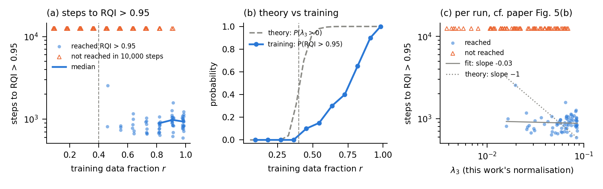
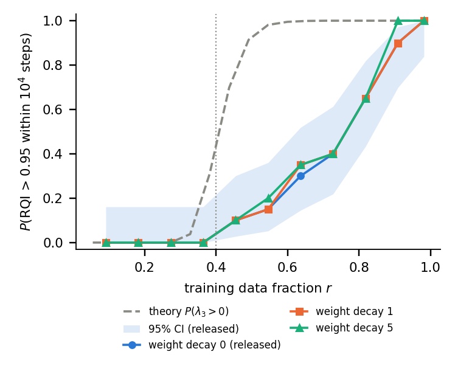
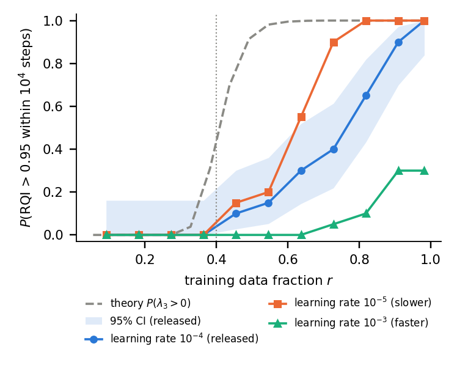

# ATDL Assignment 2 — Reproducibility study of Liu et al. (2022)

**Group 73** · **Replication Track** · Advanced Topics in Deep Learning, University of Copenhagen, 2026

Paper: Z. Liu, O. Kitouni, N. Nolte, E. J. Michaud, M. Tegmark, M. Williams,
*Towards Understanding Grokking: An Effective Theory of Representation Learning*,
NeurIPS 2022. [arXiv:2205.10343](https://arxiv.org/abs/2205.10343)

**Experiment reproduced:** the critical training-set fraction (Fig. 4).

- **(a)** The effective theory's training-free prediction: the probability that the
  training set determines a unique linear representation, i.e. P(λ₃ > 0), as a
  function of the training fraction r. Paper: transition at r_c ≈ 0.4.
- **(b)** The empirical counterpart: training steps until RQI > 0.95, across r and
  seeds.

## Layout

```
src/effective_theory.py           parallelogram constraints, spectrum of H, λ₃ (our implementation)
experiments/fig4a_critical_fraction.py   Fig. 4(a): ours on 1000 seeds + authors' code on 100, per-seed cross-check
experiments/fig4b_steps_to_rqi.py        Fig. 4(b): authors' train_add, 11 sizes x 20 seeds, resumable
experiments/fig4b_analyse.py             Fig. 4(b) summary, censoring-aware medians, figure
experiments/fig4b_extended_budget.py     10 stalled runs re-run with 50,000 steps
experiments/run_wd_ablation.sh           Ablation 1: same sweep with decoder weight decay 1 and 5
experiments/run_lrdec_ablation.sh        Ablation 2: same sweep with decoder lr 1e-5 and 1e-3
experiments/ablation_compare.py          Ablations 1-2: comparison table and figure (--which wd|lrdec)
results/fig4a/                    CSVs and the figure
third_party/grokking-squared/     authors' code, unmodified (MIT), pinned at 0229df9 (2022-11-25)
report/                           ISBI LaTeX source of the report (latexmk -pdf A2_submission.tex)
```

## Reproduce

```bash
pip install -r requirements.txt
python experiments/fig4a_critical_fraction.py        # ~1 min on CPU
python experiments/fig4b_steps_to_rqi.py             # ~50 min on 2 CPU cores
python experiments/fig4b_analyse.py
python experiments/fig4b_extended_budget.py          # ~25 min
experiments/run_wd_ablation.sh                       # ~2 h
python experiments/ablation_compare.py --which wd
experiments/run_lrdec_ablation.sh                    # ~2 h
python experiments/ablation_compare.py --which lrdec
```

## Results so far

| | Paper | This work |
|---|---|---|
| r where P(λ₃ > 0) = 0.5 | ≈ 0.4 (stated) | **0.409** (p = 10, 1000 seeds, linear interpolation) |
| Agreement with authors' code, same seeds | — | **1800 / 1800** training sets give the same null-space dimension |

P(λ₃ > 0) is 0 up to r = 0.27, 0.04 at r = 0.33, 0.31 at r = 0.38, 0.70 at r = 0.44 and
0.98 at r = 0.55. Conditional on λ₃ > 0, the median λ₃ grows monotonically with r
(0.0053 at r = 0.33 to 0.082 at r = 0.98), consistent with the paper's claim that
more data shortens the grokking timescale t_h = 1/λ₃.

### Fig. 4(b)

Setting exactly as the authors' `toy/produce_figure_data.py`: p = 10, sizes
5, 10, …, 50, 54, 10⁴ steps, AdamW (η_repr = 10⁻³, η_dec = 10⁻⁴), no weight decay, MSE.
We use **20 seeds**; the authors' script uses 3 (seeds 0–2, included in ours).

- **Exact replication:** for the authors' 3 seeds, our steps-to-RQI equal their saved
  `toy/results/fig4/` values in **33 / 33** runs.
- **The paper's claim is not reproduced.** Paper: *"The number of steps to reach
  RQI>0.95 is seen to have a phase transition at r_c=0.4."* Here the probability of
  reaching RQI > 0.95 crosses 0.5 at **r ≈ 0.76**, not 0.4: 0.10 at r = 0.45, 0.30 at 0.64,
  0.40 at 0.73, 0.65 at 0.82, 1.00 at 0.98.
- **Necessary but not sufficient.** No run whose training set leaves extra freedom
  (dof > 2) ever reached high RQI (0 / 82), as the theory requires. But only 70 / 138 runs
  *with* a determined representation (λ₃ > 0) did.
- **Stuck, not slow.** 10 stalled λ₃ > 0 runs re-run for 50,000 steps: 0 / 10 reach
  RQI > 0.95, and RQI is frozen from ≈ step 5,000 onward (max RQI 0.09–0.57).
- **No 1/λ₃ scaling among successes.** Per run, as in the paper's Fig. 5(b): over the 70
  successful runs with λ₃ > 0, the log-log slope of steps on λ₃ is −0.03 (theory: −1;
  Spearman ρ = 0.15, p = 0.22). Successful runs take ≈ 600–1,600 steps at every r.
- **The paper's own Fig. 5(b) also shows λ₃ > 0 runs that fail** (red triangles up to
  λ₃ ≈ 0.25 in their normalisation), so "necessary but not sufficient" is visible in the
  paper; the main text does not discuss it.

**Comparison with the published Fig. 4(b)** (read from the paper PDF, p. 5). The published
panel marks failures separately, so it does *not* plot failures as slow successes;
only the authors' `Figure4ab.ipynb` does that. Its failures stop at r ≈ 0.55 and its
successful runs take ≈ 150–550 steps, decreasing with r, over a finer grid (r ≈ 0.27–0.98)
with ≈ 2–3 runs per size. Neither the released configuration (our 20 seeds) nor the
authors' own saved results for it (`toy/results/fig4/`, 3 seeds: failures up to r = 0.73,
successes 739–2,553 steps) match that. The hyperparameters behind the published panel
are not stated anywhere in the paper, appendices included (Appendix G gives only the
embedding lr and decoder architecture). Fig. 5(b) reports
≈ 10³–6×10³ steps, a third scale, so Figs. 4(b) and 5(b) also appear to use different
settings.

**Where the released defaults sit.** In the paper's phase diagrams (Fig. 6(a),(b), at the
45/55 split, r = 0.82), embedding lr 10⁻³, decoder lr 10⁻⁴, weight decay 0 lies on the
boundary of the comprehension region; at r = 0.82 we find 13/20 runs succeed, consistent
with a boundary. Increasing decoder weight decay at this decoder lr moves into the
grokking region, which motivates the weight-decay ablation.



### Ablation 1: decoder weight decay

Same 11 sizes x 20 seeds, decoder weight decay 1 and 5 (the paper's phase diagram spans
0-10); everything else unchanged.

| decoder wd | runs with λ₃ > 0 reaching RQI > 0.95 | 50 % crossing |
|---|---|---|
| 0 (released default) | 70 / 138 | r ≈ 0.76 |
| 1 | 71 / 138 | r ≈ 0.76 |
| 5 | 74 / 138 | r ≈ 0.76 |

Runs with λ₃ = 0 never reach high RQI in any setting (0 / 82 each). At wd = 5 only 4 of
the 68 baseline failures with λ₃ > 0 flip to success; the remaining stalled runs end at
RQI 0.04-0.71. **Decoder weight decay does not close the gap to the theory or to the
published panel.** Mechanism check: AdamW's decoupled decay multiplies weights by
(1 − η·wd) per step, so over 10⁴ steps at η_dec = 10⁻⁴ the cumulative shrinkage is
e⁻¹ (wd = 1) or e⁻⁵ (wd = 5); wd = 5 is a strong pressure, yet the outcome barely moves.



### Ablation 2: decoder learning rate

Same 11 sizes x 20 seeds; decoder lr 10⁻⁵ and 10⁻³ around the released 10⁻⁴; embedding
lr fixed at 10⁻³, no weight decay. Motivated by the paper's own mechanism (Sec. 4.1,
Fig. 6(a)): structure forms only if representation learning outpaces decoder fitting.

| decoder lr | runs with λ₃ > 0 reaching RQI > 0.95 | 50 % crossing | paired vs default (same splits) |
|---|---|---|---|
| 10⁻⁵ (slower) | **96 / 138** | **r ≈ 0.62** | 28 fail→success, 2 success→fail (exact McNemar p ≈ 9×10⁻⁷) |
| 10⁻⁴ (released default) | 70 / 138 | r ≈ 0.76 | — |
| 10⁻³ (faster) | **15 / 138** | not reached (max 0.30) | 0 fail→success, 55 success→fail (p ≈ 6×10⁻¹⁷) |

- **A monotone dose-response in the direction the paper predicts.** A slower decoder
  rescues structure; a faster one destroys it. Runs with λ₃ = 0 never succeed in any
  setting (0 / 82 each), so λ₃ > 0 stays necessary.
- **Fast decoder = memorisation:** its failures fit the training set (≥ 93 % train accuracy)
  but reach 25 % test accuracy on average.
- **The 1/λ₃ trend partly returns with a slow decoder:** among its 96 successes, steps fall
  as λ₃ rises (Spearman ρ = −0.38, p = 10⁻⁴; log-log slope −0.26, theory −1). With the
  default decoder there was none (ρ = 0.15, p = 0.22). Successes take ≈ 2,500–4,100 steps
  (median per size), decreasing with r.
- **Still not the theory's r_c = 0.4.** Even the slow decoder crosses 50 % at r ≈ 0.62,
  and 42 / 138 determined runs fail. Of 8 such failures re-run for 50,000 steps, 1
  briefly crossed RQI 0.95 (step 21,217, then fell back to 0.67); 7 plateaued at RQI
  0.06–0.39. So the gap is not a step-budget artefact.



## Notes for part (b)

- The authors train with **AdamW**, not plain gradient descent. The theory's
  n_h = 1/(λ₃ η) is derived for gradient flow on the effective loss, so absolute step
  counts are not expected to match; compare the **scaling** of steps-to-RQI with r
  (and with 1/λ₃), not the numbers.
- H is computed as 2 A_Dᵀ A_D / (|P₀(D)| Z₀) with Z₀ = p, from ℓ_eff = ½ Rᵀ H R (eq. 8)
  and normalised 1-D embeddings. The constant only rescales λ₃; it does not affect (a).
- Appendix G (arXiv version) gives the decoder (MLP 1-200-200-30) and embedding lr 10⁻³,
  matching the released code, but no decoder lr, weight decay, seeds or step budget for
  Fig. 4(b). Table 1 defines the phases with 10⁵ steps; the released phase-diagram
  code uses 10⁴.
- In the toy task, test accuracy is capped by the *ideal* accuracy: some test sums
  cannot be inferred from the training pairs even with a perfect representation.
